<h1>
            Classification Machine Learning (ML ) Project For Strokes Prediction</h1>

<h2>General Information About The Project: </h2>

<ul>

<li>The whole project is available at healthcare.py file</li>
<li>prediction.py is an example of inputting values and getting a prediction based on the ML models from the project</li>

<li>The project investigates  the <a
                    href="https://www.kaggle.com/datasets/fedesoriano/stroke-prediction-dataset">Stroke Prediction
                    Dataset</a> from kaggle.com and utilizes multiple ML Models based on the data</li>
<li>The dataset is used to predict whether a patient is likely to get a stroke or not based 12 input feature
                parameters. 11 feature parameters if we ignore the "id" feature column </li>
<li>The used  ML models have the following constrains </li>
<ul>
<li>Patients 18+ </li> 
<li>Patients have a BMI below 60 </li>

</ul>

<li>The list of topics presented in this project are presented in their order below:</li>
<ol>
<li>Import all the main Python libraries</li>
<li>Import the data</li>
<li>Perform (Exploratory Data Analysis) EDA on the data</li>
<ul>
<li>Dropping columns if required </li>
<li>Analyzing the unique inputs of each column </li>
                    <li>Analyzing all the rows</li>
<li>Conducting conclusions based on mathematical evidence</li>
<li>Constructing plots based on the mathematical evidence</li>
</ul>
<li>Utilizing  OneHotEncoding, to ensure all of the categorical columns are ready for the ML process</li>
                <li>Splitting the data into a training dataset (70%) and a test dataset (30%)</li>
                <li>After conducting EDA, it came to realization that the data is unbalanced. Therefore, SMOTE was
                    utilized to synthetically create random data for the unbalanced class and make the datasets
                    balanced. SMOTE was applied to only the training dataset </li>
                <li>Scaling the data. Even though some of the employed ML models did not need scaling (e.g., Decision
                    Trees and Random Forest) we preferred to use the scaled data to compare all the models based on the
                    same exact scaled datasets</li>
                <li>Conduct the ML analysis by utilizing the following algorithms for classification</li>

                <ol>
                    <li>Logistic Regression</li>
                    <li>K-Nearest Neighbors (KNN)</li>
                    <li>Support Vector Machines (SVM) For classification</li>
                    <li>Decision Trees (With Adaboost and Gradient Boost)</li>
                    <li>Random Forest</li>
                </ol>

            </ol>

            <li> For each of the ML algorithms: </li>
            <ul>
                <li>Cross Validation of "was utilized with 10 folds using GridSearchCV of Scikit-learn .Then, the
                    optimum hyperparameters are selected to train the model </li>
                <li>Each model contained GridSearchCV hyperparameters that optimized for the metrics of Recall,
                    Precision and Accuracy </li>
            </ul>

        <h2>EDA Conclusions Written Information: </h2>

        <ul>
            <li>There is a total of <b>12</b> features which are: </li>
            <ul>
                <li><b>id</b>, this parameter  is a unique identifier </li>
                <ul>
                    <li>This column was <b>dropped</b> due its irrelevance when it comes to training ML models </li>
                </ul>

                <li><b>gender</b>, this parameter represent the gender of the patient. The inputs are: "Male", "Female" or "Other" </li>
                <ul>
                    <li>The input of <b>"Other"</b> was dropped, because it has a single input data and it would not have been
                        possible to utilize this input </li>
                </ul>

                <li><b>age</b>, this parameter represents the age of patients </li>
                <ul>
                    <li>All the rows of age below 18 were dropped, because the ML models were built for people that are older than 18</li>
                </ul>

                <li><b>hypertension</b>, this parameter represent if a patient has hypertension or not. The inputs are: 0 and 1. 0 if the patient doesn't have hypertension, 1 if the patient has hypertension
                </li>

                <li><b>heart_disease</b>, this parameter represent if a patient has a heart_disease or not. The inputs are 0 and 1. 0 if the patient doesn't have any heart diseases, 1 if the patient has a heart
                    disease </li>

                <li><b>ever_married</b>, this parameter represent if a patient has ever been married or not. The inputs are: "No" or "Yes" </li>

                <li><b>work_type</b>, this parameter represent the type of work the patient does. The inputs are: "children", "Govt_jov", "Never_worked", "Private" or "Self-employed"</li>
                <ul>
                    <li>The input of <b>"Never_worked"</b>,was dropped, because it has a few input data and it would not have been
                        possible to utilize this input </li>
                        <li>The input of <b>"children"</b>,was dropped, because the employed ML models were meant to predict patients older than 18 </li>
                    </ul>

                <li><b>Residence_type</b>, this parameter represent the location the patient lives at. The inputs are: "Rural" or "Urban"</li>

                <li><b>avg_glucose_level</b>, this parameter represents the average glucose level in blood</li>

                <li><b>bmi</b>, this parameter represents the body mass index</li>
                <ul>
                    <li>201 rows were dropped from the dataset and all of them had NaN for their bmi</li>
                    <li>All bmi above 60 were dropped. The data is built for data below a bmi of 60</li>
                </ul>

                <li><b>smoking_status</b>, this parameter represent the smoking status of the patient. The inputs are: "formerly smoked", "never smoked", "smokes" or "Unknown"*</li>

                <li><b>stroke</b>, this is the "Label" parameter and it indicates if the patient has a stroke or not. The inputs are: 0 and 1. 1 if the patient had a stroke or 0 if no</li>
                <ul>
                    <li>The label parameter represent an imbalanced data</li>
                </ul>                  
            </ul>

        </ul>

        <h2>EDA Conclusions Plots: </h2>

        <ul>

            <li>A count plot of the "Label" column, which is <b>stroke</b> </li>
            <ul>
                <li>The plot shows that we are working with an imbalanced data set. less than <b>5% </b>of the data are
                    in the stroke class and <b>95%</b> are not in the stroke category </li>
                 
   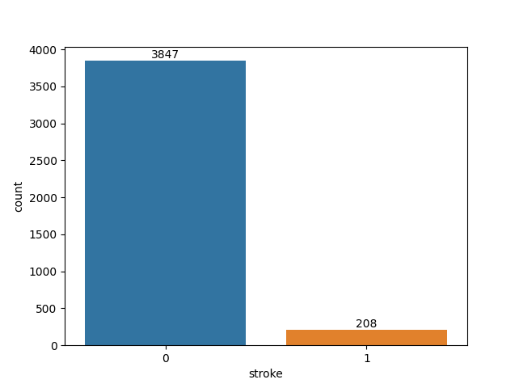   

            </ul>

            <li>A bar plot showing correlation plot between 'Label' & all the 'Numerical' columns  </li>
            <ul>
                <li>The plot indicates that the most correlated "Numerical" column is <b>age</b>. Then, followed by: <b>avg_glucose_level</b>, <b>hypertension</b>, <b>heart_disease</b>, and <b>bmi</b>  </li>
                
 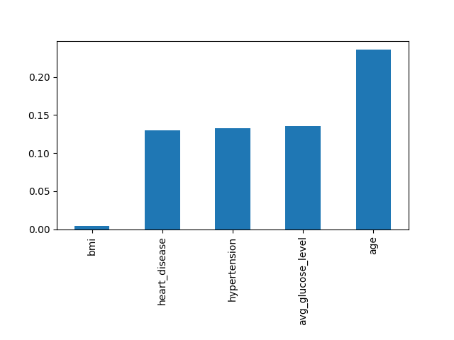 

            </ul>

            <li>A heatmap showing correlation plot between all the 'Numerical' columns  </li>
            <ul>
                <li>The <b>age</b> and <b>heart_disease</b> have the highest correlation of 26%. Also, <b>age</b> seems to be a highly correlated column with all the other numerical columns  </li>
                
 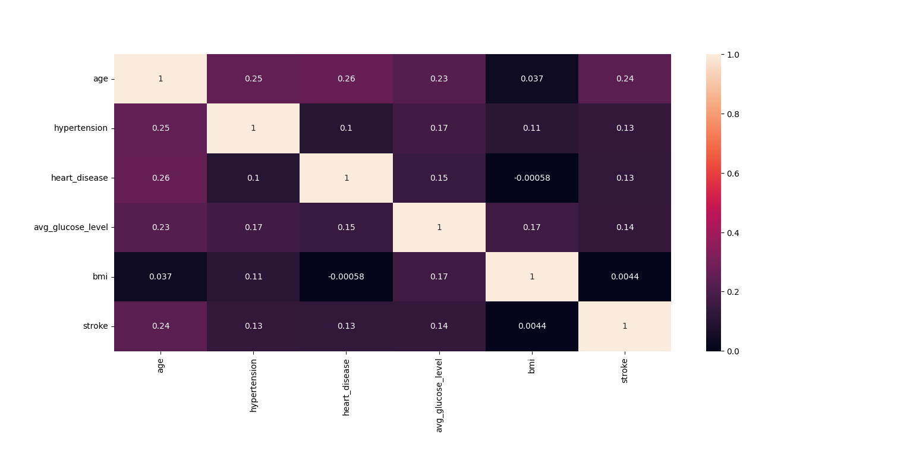 

            </ul>

            <li>A count plot of the number of strokes between the male and female patients  </li>
            <ul>
                <li>The percentage of male patients that have a stroke is <b>5.6%</b> and the percentage of female patients that have a stroke is <b>4.8%</b>. Males do have a higher stroke percentage but it is minimal  </li>
                
 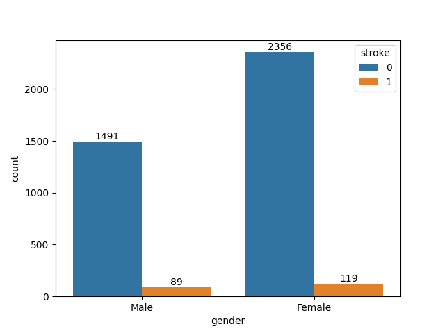 

            </ul>            

            <li>A count plot of the number of strokes between patients that have hypertension and the patients that do not </li>
            <ul>
                <li>The percentage of patients that have a stroke and hypertension is <b>13%</b> and percentage patients that have a stroke and do not have hypertension is <b>4.1%</b>. Hypertension
                    is clearly a paramter that contrubutes to have a stroke  </li>
                
 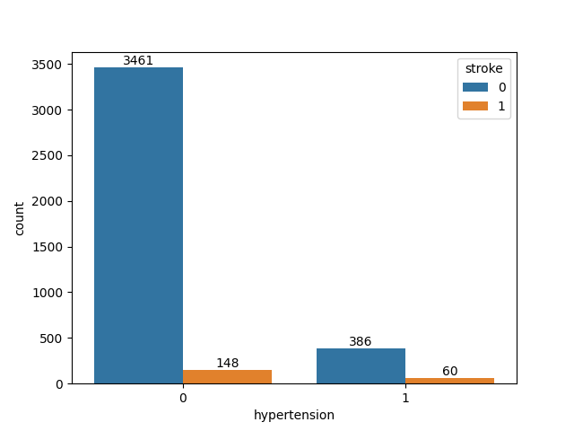 

            </ul>                 

            <li>A count plot of the number of strokes between patients that have heart disease and the patients that do not </li>
            <ul>
                <li>The percentage of patients that have a stroke and heart disease is <b>16%</b> and percentage patients that have a stroke and do not have hypertension is <b>4.4%</b>. Heart disease
                    is clearly a paramter that contrubutes to have a stroke  </li>
                
 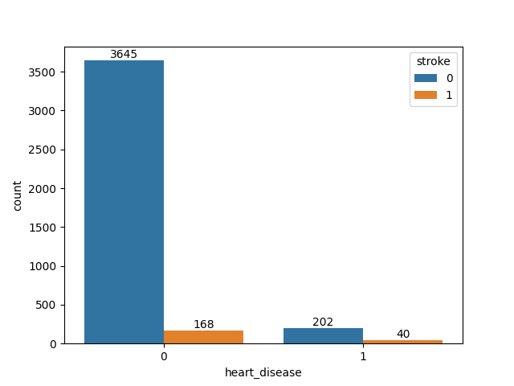 

            </ul>   

            <li>A count plot of the number of strokes between patients that have been ever married or not </li>
            <ul>
                <li>The percentage of patients that have a stroke and ever being married is <b>5%</b> and percentage patients that have a stroke and never been married is <b>2.5%</b>. From the data being ever married has a higher influence to having a stroke  </li>
                
 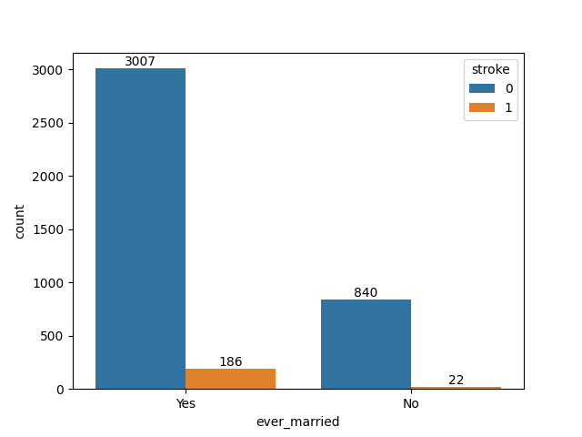 

            </ul>               

            <li>A count plot of the number of strokes between patients different types of work </li>
            <ul>
                <li>The percentage of patients that are self employed have the highest percentage of a stroke at <b>4%</b> while other types of work have a percentage of stroke at around <b>4.5%</b> </li>
                
 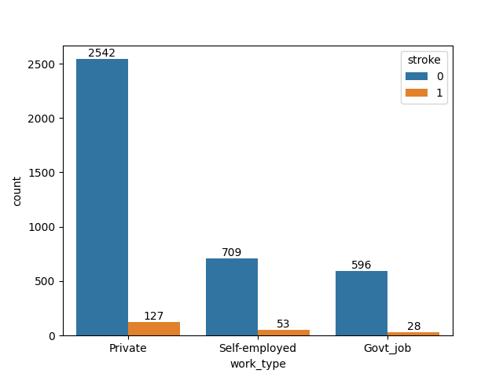 

            </ul>               

            <li>A count plot of the number of strokes between patients different areas of living</li>
            <ul>
                <li>The percentage of patients depending on the location of their stay is very similar at around <b>5%</b></li>
                
 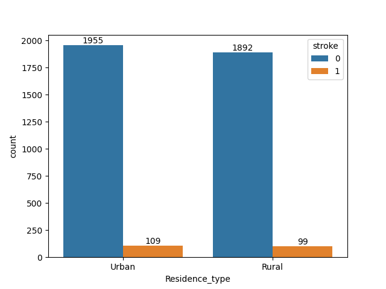 

            </ul>               

            <li>A count plot of the number of strokes between patients different smoking status </li>
            <ul>
                <li>The percentage of patients that have a stroke and formerly is the highest at <b>7%</b> in comparison to the other options which have an average of around <b>4.5%</b>  </li>
                
 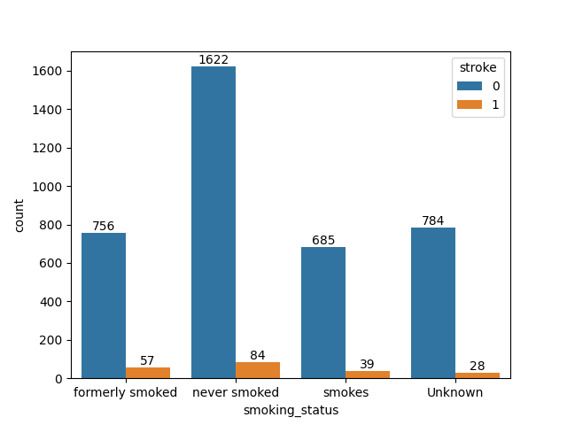 

            </ul>  

            <li>A bar plot showing the relationship of strokes and age</li>
            <ul>
                <li>Older patients tend to be more prone to having a stroke than younger patients  </li>
                
 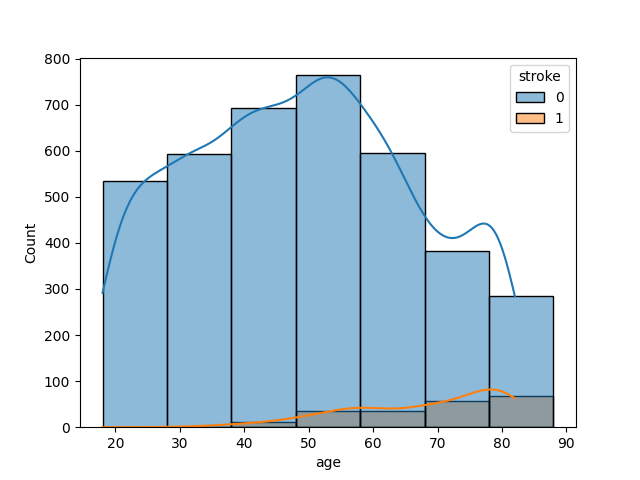 

            </ul>             

            <li>A bar plot showing the relationship of strokes and average glucose levels</li>            <ul>
                <li>Patients that have an average glucose levels between 55-100 tend to be more prone to having a stroke </li>
                
 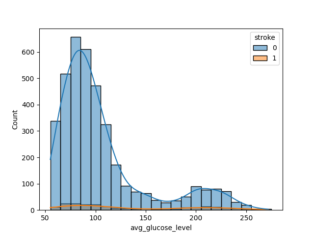 

            </ul>             

            <li>A bar plot showing the relationship of strokes and bmi levels</li>            <ul>
                <li>Patients that have a bmi above 22 tend to be more prone to having a stroke </li>
                
 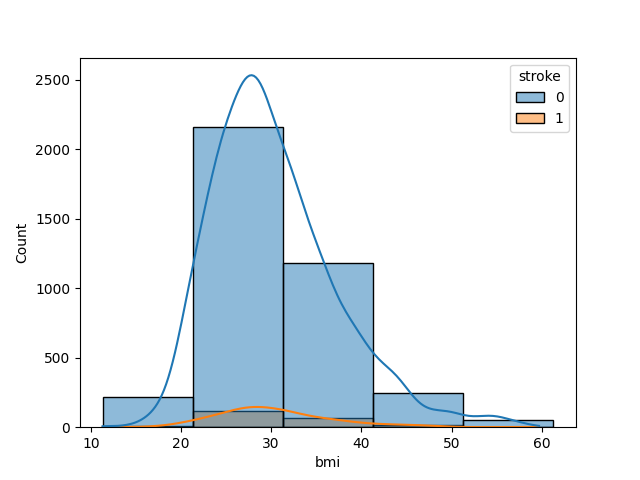 

            </ul>             

        </ul>

        <h2>Main Metrics of Evaluation: </h2>

        <ul>
            <li>The main metrics we focused on were: </li>
            <ul>
                <li>Increase Recall, because higher recall means a decrease in <b>False Negatives</b> </li>
                <li>Decrease the False Negatives, because in the case of this data set we want to minimize the number of
                    patients that are told that they will not have a stroke but end up having a stroke</li>

            </ul>

        </ul>

        <h2>Comparison  of the Algorithms: </h2>

    <table style="width:80%">
        <tr>
            <td><b>Algorithm</b></td>
            <td><b>False Negative</b></td>
            <td><b>True Positive</b></td>
            <td><b>True Negative</b></td>
            <td><b>False Positive</b></td>

        </tr>
        <tr>
            <td><b>Logistic Regression - Metric = Recall </b></td>
            <td>20 </td>
            <td>827 </td>
            <td>47 </td>
            <td>323 </td>

        </tr>

        <tr>
            <td><b>Logistic Regression - Metric = Precision </b></td>
            <td>20 </td>
            <td>827 </td>
            <td>47 </td>
            <td>323 </td>

        </tr>

        <tr>
            <td><b>Logistic Regression - Metric = Accuracy </b></td>
            <td>20 </td>
            <td>827 </td>
            <td>47 </td>
            <td>323 </td>

        </tr>

        <tr>
            <td><b>KNN - Metric = Recall </b></td>
            <td>60 </td>
            <td>1072 </td>
            <td>7 </td>
            <td>78 </td>

        </tr>

        <tr>
            <td><b>KNN - Metric = Precision </b></td>
            <td>60 </td>
            <td>1086 </td>
            <td>7 </td>
            <td>64 </td>

        </tr>

        <tr>
            <td><b>KNN - Metric = Accuracy </b></td>
            <td>60 </td>
            <td>1086 </td>
            <td>7 </td>
            <td>64 </td>

        </tr>

        <tr>
            <td><b>SVM-SVC - Metric = Recall </b></td>
            <td> <b>6 </b> </td>
            <td>  <b>353 </b>   </td>
            <td>    <b> 61</b>    </td>

            <td>    <b> 797</b>  </td>

        </tr>

        <tr>
            <td><b>SVM-SVC - Metric = Precision </b></td>
            <td>67 </td>
            <td>1147 </td>
            <td>0 </td>
            <td>3 </td>

        </tr>

        <tr>
            <td><b>SVM-SVC - Metric = Accuracy </b></td>
            <td>58 </td>
            <td>1089 </td>
            <td>9 </td>
            <td>61 </td>

        </tr>

        <tr>
            <td><b>Decision Trees (Adaboost) - Metric = Recall </b></td>
            <td> <b>5</b> </td>
            <td> <b> 571  </b> </td>
            <td>   <b> 62</b></td>
            <td> <b> 579</b></td>

        </tr>

        <tr>
            <td><b>Decision Trees (Adaboost) - Metric = Precision </b></td>
            <td>66 </td>
            <td>1149 </td>
            <td>1 </td>
            <td>1 </td>

        </tr>

        <tr>
            <td><b>Decision Trees (Adaboost) - Metric = Accuracy </b></td>
            <td>63 </td>
            <td>1141 </td>
            <td>4 </td>
            <td>9 </td>

        </tr>

        <tr>
            <td><b>Decision Trees (Gradient Boost) - Metric = Recall </b></td>
            <td>61 </td>
            <td>1138 </td>
            <td>6 </td>
            <td>12 </td>

        </tr>

        <tr>
            <td><b>Decision Trees (Gradient Boost) - Metric = Precision </b></td>
            <td>67 </td>
            <td>1148 </td>
            <td>0 </td>
            <td>2 </td>

        </tr>

        <tr>
            <td><b>Decision Trees (Gradient Boost) - Metric = Accuracy </b></td>
            <td>64 </td>
            <td>1137 </td>
            <td>3 </td>
            <td>13 </td>

        </tr>

        <tr>
            <td><b>Random Forest - Metric = Recall </b></td>
            <td>63 </td>
            <td>1119 </td>
            <td>4 </td>
            <td>31 </td>

        </tr>

        <tr>
            <td><b>Random Forest - Metric = Precision </b></td>
            <td>64 </td>
            <td>1138 </td>
            <td>3 </td>
            <td>12 </td>

        </tr>

        <tr>
            <td><b>Random Forest - Metric = Accuracy </b></td>
            <td>67 </td>
            <td>1141 </td>
            <td>0 </td>
            <td>0 </td>

        </tr>

    </table>

            <h2>Study Conclusions Metrics of Evaluation: </h2>

            <ul>
                <li>Decreasing False negatives is the primary goal of the study therefore, the algorithms that decrease False Negatives the most were <b> Decision Trees with Adaboost boosting</b> followed by <b> SVM </b> </li>
                <li>During the GridSearchCV of both of these algorithms recall was set to be the metric, which makes sense why False Negatives were lower </li>
                <li>Out of these two algorithms  <b> Decision Trees with Adaboost boosting</b> performed better in the aspects of True Positives as well in Comparison to  <b> SVM </b> making it the best algorithm for this study</li>
                <li>The <b> Decision Trees with Adaboost boosting</b> GridSearchCV compared the following combinations of hyperparameters </li>
                <ul>
                    <li>Number of Trees: 10, 50, and 100
                    <li>learning_rate  0.01, 0.1, and 1 </li>
                    </ul>
                    <li>The selected number of trees was 10 and the learning rate was 0.01</li>
                    <li>The lowest learning rate was selected which means each tree in the has lesser say on the final decision </li>
                    <li>The lowest number of trees was selected which leads to a lower overfitting possibility </li>

                </ul>

            </ul>
